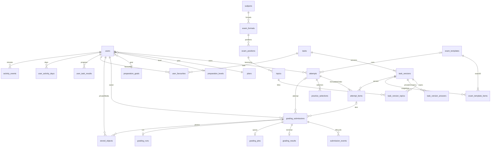
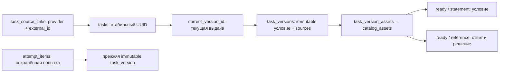

# Фактическая база BotAI

## Проверка за 5 минут

1. Открой [локальный Adminer](http://127.0.0.1:18090/?pgsql=postgres&username=botai_operator&db=botai) или [серверный через tunnel](http://localhost:28090/?pgsql=postgres&username=botai_operator&db=botai). Слева нажми **«выбрать»** рядом с `operator_accounts`: название таблицы открывает структуру, «выбрать» показывает строки
2. В профиле сайта укажи узнаваемое имя, затем найди его в столбце `display_name` и скопируй `id` этой строки. `plan_id`: `free` - бесплатный, `pro` - Pro. Email и паролей в этом безопасном виде нет
3. На сайте создай подборку из **3 заданий**, введи ответ и дождись **«Сохранено»**. Перейди на второе задание, вернись на главную, обнови страницу и нажми «Продолжить подборку». Ответ и выбранное задание должны восстановиться
4. В Adminer нажми «выбрать» у `operator_attempts`. В блоке поиска выбери `user_id`, условие `=`, вставь свой `id` и нажми «Выбрать». Свежая строка - твоя подборка; скопируй её `id`
5. В этой строке `kind=training` означает подборку, `mock-exam` - пробник. `status=active` - не завершена, `checking` - идёт проверка, `completed` - все задания проверены. `current_index` считается с нуля: `0` - первое задание, `1` - второе. `revision` растёт при сохранении
6. Нажми «выбрать» у `operator_attempt_items`; в поиске поставь `attempt_id =` скопированный ID подборки. Должно быть **3 строки**. `ordinal` задаёт порядок, `answer_revision` - версию ввода. Текст ответа и рисунок здесь скрыты: их сохранение проверяй возвратом в приложение из шага 3
7. Для пробника повтори шаги: одна новая строка `mock-exam` в `operator_attempts` и **20 строк** с её ID в `operator_attempt_items`
8. `operator_submissions` показывает отправленные проверки и их статусы. Сами фото, ответ ИИ и историю событий смотри в продуктовой админке **Профиль → «Проверки учеников»** (`/admin/submissions`), доступной ADMIN

Для этой проверки достаточно четырёх видов: accounts, attempts, attempt_items и submissions. Это просмотр данных; управление пользователями и редактирование банка задач в текущей админке не реализованы

Схема проверена запросами `information_schema` и `pg_constraint` на локальном PostgreSQL **17.11**, после успешных миграций **V1–V6**, 2026-10-05. Это отдельная интеграционная база; production auth/session база не изменена.

## Что где хранится

- `users` — существующий аккаунт и дата регистрации; связи на `plans`, `preparation_levels`, `preparation_goals`, аватар. Пароль, сессии и OTP остаются в закрытой auth-части (`spring_session`, `spring_session_attributes`, `one_time_codes`).
- `subjects → exam_formats → exam_positions → topics` — профильная математика, формат20, позиции и140 тем. `tasks → task_versions` — каноническое задание и неизменяемые версии; `task_version_topics` связывает темы, `task_version_answers` содержит закрытые допустимые ответы. В public Task эталонов нет.
- **`attempts` — сохранённая обёртка коллекции/пробника**, а не временный выбор frontend. В ней владелец, тип, статус, revision и current_index. `attempt_items` фиксирует порядок и точную task_version, ответ, drawing и revision. `practice_selections` сохраняет критерии выбора. Несколько unfinished попыток сосуществуют; возврат открывает тот же UUID.
- `exam_templates` / `exam_template_items` — опубликованный неизменяемый шаблон ровно20 позиций; каждый запуск создаёт отдельную историю в `attempts`.
- `grading_submissions` — намерение проверки до загрузки, жизненный цикл, owner/attempt/item и revision; `submission_events` — история; `grading_jobs` — PostgreSQL очередь; `grading_runs` — run/fence/provenance; `grading_results` — один терминальный результат и закрытый точный AI JSON. Отказ/ошибка/unsupported не превращаются в нулевую оценку.
- `stored_objects` хранит **метаданные** частных объектов: owner, submission, purpose, размер, тип, состояние, ключ. **Байты фото и аватаров находятся в private Garage S3**, отдельно от PG. API `/api/media/{id}` проверяет владельца/admin, отдаёт no-store; публичной S3 ссылки нет. Backup должен включать PG **и** Garage metadata/data.
- `user_favourites`, `user_task_results`, `user_activity_days`, `activity_events` — отношения конкретного пользователя и серверный прогресс; синтетические задания и mock AI его не начисляют. `attempt_checks` обеспечивает дедупликацию; `admin_access_events` фиксирует просмотр модератором; `rate_limit_windows` — технические лимиты.



## Посмотреть самому

### Добавление каталога V7 — пока не применено стендам

Код миграции и importer проверены на отдельном PostgreSQL; рабочие local/stage сохраняют V1–V6 и прежние данные до одобренного pilot. Новый provider identity не заменяет тему и не меняет пользовательскую историю:



После применения V7 `operator_task_sources` покажет provider/external ID и UUID задания; `operator_task_versions` — публичное происхождение `sources` и готовность текстового AI input. `operator_catalog_assets` покажет состояние и размеры, без bucket/key и содержимого; `operator_import_runs/items` — исходы публикации и причины карантина. Неизвестный год остаётся null. Карантин не появляется в текущей выдаче; повторный импорт не создаёт вторую задачу.

`sources` содержит только сведения об источнике. Ответ, точное решение и их изображения остаются за отдельной границей раскрытия. Для extended stable unsupported ученик явно открывает эталон без оценки: immutable grant привязан к revision текста/рисунка и последней submission ID/revision. Новое фото или правка делает grant недействительным. Это не результат AI и не начисление progress. Подробнее: [контракт импорта](CONTENT-IMPORT-SPEC.md).

Локально открыть [Adminer](http://127.0.0.1:18090/?pgsql=postgres&username=botai_operator&db=botai), система PostgreSQL, server `postgres`, database `botai`, user `botai_operator`. Пароль в **`botai-back/runtime/credentials.json`**, файл0600 вне Git. Включение: `scripts/integration/compose.sh --profile ops up -d adminer`.

Оператор по умолчанию read-only. Доступны справочники и `operator_accounts/tasks/task_versions/attempts/attempt_items/submissions/results/objects/jobs/runs/activity_days`. Вид `operator_accounts` не содержит email, password_hash или provider ID; `operator_objects` скрывает S3 keys; результаты не содержат точный AI JSON/эталоны. SELECT на users, sessions, OTP, answer keys и raw objects/results проверен как запрещённый. Продуктовая модерация — отдельная `/admin/submissions` с ADMIN, не Adminer.

Полезные SQL:

```sql
SELECT * FROM operator_attempts ORDER BY updated_at DESC LIMIT 50;
SELECT * FROM operator_attempt_items WHERE attempt_id = 'UUID' ORDER BY ordinal;
SELECT * FROM operator_submissions ORDER BY created_at DESC LIMIT 50;
SELECT * FROM operator_objects ORDER BY created_at DESC LIMIT 50;
SELECT table_name,column_name,data_type FROM information_schema.columns
WHERE table_schema='public' ORDER BY table_name,ordinal_position;
```

Структура физической схемы может быть видна в information_schema только в пределах разрешений роли. Полный introspection для администратора через локальный контейнер: `scripts/integration/compose.sh exec postgres psql -U botai_migrator -d botai`; не публиковать его credentials и не использовать migrator для обычного просмотра.

Для отдельного серверного stage: `ssh -N -L localhost:23000:127.0.0.1:13000 -L localhost:28090:127.0.0.1:18090 -L localhost:28025:127.0.0.1:18025 ege-server`. Серверный backend/PG/Garage/AI уже работают, [Adminer](http://localhost:28090/?pgsql=postgres&username=botai_operator&db=botai) доступен через этот tunnel. Сайт работает на http://localhost:23000. Stage credentials отдельно `/srv/botai-integration/runtime/credentials.json`; это свежие серверные учётные данные, не локальные пароли. Серверная отдельная база также применяет V1–V6; backup/restore PostgreSQL и S3 проверен, фактическое состояние в RUNTIME-EVIDENCE.md.
