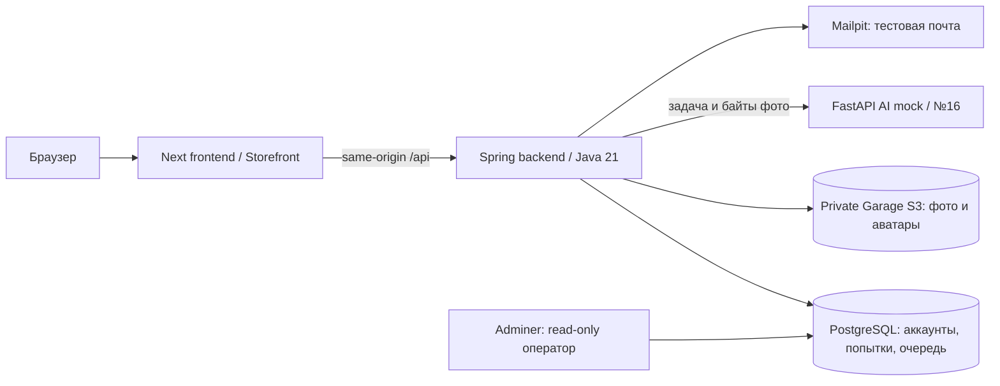

# BotAI — исторический срез интеграции до наполнения реальным банком, 2026-10-05

Зафиксирована завершённая работа по объединению frontend и поднятию сервисов **до начала импорта реальных заданий**. Контрольная точка: backend `6f5dfaed251d085253ec0baefa6efb3e5e33c6e4`, frontend implementation `6bcd2821a430268cfcee37eccde9f5fff7490423`, финальные frontend-документы `f6d8babff89c9049e2d15131cc193c40a0a72d0b`. Это отчёт по проверенному состоянию, а не новая проверка работающих сервисов. Последующие изменения импорта сюда не включены.

На этой точке были готовы **два частных стенда по 7 сервисов**: Mac и отдельный server stage. Большой Storefront и учебное приложение объединены в основном `botai-front/develop`; интерфейс подключён к backend, PostgreSQL и частному S3. Сквозная проверка фото проходит через настоящий upload/storage/worker, но AI отвечает в mock-режиме. База — **V1–V6, 20 номеров, 140 тем, 100 оригинальных синтетических заданий, по 5 на номер**. Реального банка в этом срезе ещё нет.

**Граница среза:** адреса, состояния сервисов, проверки и ограничения ниже относятся к контрольной точке до импорта. Они не описывают текущий доступ или последующий публичный запуск. Прежний сбой SSH был временным; использовать этот отчёт как текущую сводку доступности нельзя.

## Архитектура и доступ



| Сервис | Назначение | Mac / loopback сервера | Доступ к stage через tunnel |
|---|---|---|---|
| Frontend, Next 16.3.8 | Сайт и учебный кабинет, proxy `/api` | `127.0.0.1:13000` | `localhost:23000` |
| Backend, Java 21 | Auth, учебные API, storage и worker | `127.0.0.1:18082` | `localhost:28082` |
| PostgreSQL 17.11 | Данные, JDBC sessions, очередь | Без host port | Через Adminer |
| Garage 2.3.0 | Частные объекты, отдельные data/metadata volumes | Без host port | Через backend |
| FastAPI AI | Изолированный mock, registry №14–20 | Без host port | Через backend |
| Mailpit 1.27.8 | SMTP sink и просмотр писем | `127.0.0.1:18025` | `localhost:28025` |
| Adminer 5.4.1 | Безопасные представления БД | `127.0.0.1:18090` | `localhost:28090` |

Входы на описанной точке: [локальный сайт](http://127.0.0.1:13000), [локальная база](http://127.0.0.1:18090/?pgsql=postgres&username=botai_operator&db=botai), [локальная почта](http://127.0.0.1:18025); [stage сайт](http://localhost:23000), [stage база](http://localhost:28090/?pgsql=postgres&username=botai_operator&db=botai), [stage почта](http://localhost:28025).

Compose projects: `botai-integration-local` и `botai-integration-stage`, собственные volumes, сети и секреты. Stage расположен в `/srv/botai-integration/{back,front,ai,runtime,backups}`, SSH alias — `ege-server`. `back/runtime` ссылается на `../runtime`, `runtime/backups` — на `../backups`. Stage marker автоматически подключает ограничения `compose.stage.yaml`.

Браузер обращается к API через свой frontend. `BACKEND_URL=http://backend:8080` закреплён в production rewrite при сборке; смена адреса требует пересборки frontend. **Локально использовать `127.0.0.1`, для stage — `localhost`**: cookies не различают порты. Stage `FRONTEND_BASE_URL=http://localhost:23000`; обе свежие email-ссылки и разделение сессий проверены.

## Что было реализовано

- Восстановлен актуальный большой Storefront: главная, маркетинговые блоки, цены, изображения, вход нового/авторизованного пользователя; сохранены desktop/sidebar и mobile учебные экраны, Onest, бренд и актуальные mascot assets из develop.
- Подключены настоящие регистрация, login/logout, session/CSRF, подтверждение почты и профиль. Onboarding сохраняет goal/level/day/notifications в backend и приводит на настоящий HOME; повторная регистрация авторизованному пользователю не навязывается.
- Каталог переведён на 20 номеров/140 тем; доступны выбор номеров и количества задач, подборки, избранное, пробник из 20 задач. Итог в первичных баллах, максимум формата 33; выдуманной конвертации в 100 баллов нет.
- Подборка и пробник — сохранённые `Attempt`, каждый со своим UUID, владельцем и фиксированным порядком версий. HOME показывает **все** незавершённые попытки и различает «Продолжить подборку №…» и «Продолжить пробник».
- Ответы, рисунки, фото, результаты и текущая позиция переживают reload и logout/login. Возврат продолжает ту же попытку. Ошибка сохранения сохраняет черновик; Retry после восстановления backend и полный reload проверены в браузере.
- Короткие ответы проверяет сервер. Фото отправляются реальными байтами, нормализуются, сохраняются в private S3; очередь PostgreSQL передаёт доверенную задачу и фото AI. Состояния ожидания, ошибки, отказа и unsupported отображаются без ложной оценки.
- Профиль и настройки сохраняются; загрузка, просмотр и удаление аватара проходят через backend/S3. Избранное и данные попыток разделены по аккаунтам; старые mock caches очищаются/изолируются при смене пользователя.
- ADMIN получает журнал `/admin/submissions`: фильтры, события жизненного цикла, частные фото, структурированный результат и точный проверенный AI JSON. Это админка проверок; управление пользователями, ролями и редактирование банка здесь не реализованы.

`test@test.test` подготовлен на обоих стендах: USER, тестовый Pro, подтверждённая почта. Пароль задан пользователем и хранится приватно. **Прежние тестовые аккаунты сохранены**; роли общих аккаунтов для QA не переустанавливались. Отдельные synthetic fixture accounts использовались для отрицательных проверок.

## База и границы данных

| Группа | Основные сущности и смысл |
|---|---|
| Аккаунт | `users`, `plans`, `preparation_levels`, `preparation_goals`; закрытые `spring_session`, `spring_session_attributes`, `one_time_codes` |
| Каталог | `subjects → exam_formats → exam_positions → topics`; `tasks → task_versions`, `task_version_topics`, закрытые `task_version_answers` |
| Попытки | `attempts`, `attempt_items`, `practice_selections`: владелец, kind/status/revision/current_index, порядок, конкретная версия, ответ и drawing |
| Пробники | `exam_templates`, `exam_template_items`: неизменяемый шаблон ровно из 20 позиций; каждый запуск создаёт новую историю |
| Проверки | `grading_submissions`, `submission_events`, `grading_jobs`, `grading_runs`, `grading_results`: intent, очередь, dispatch/fence, терминальный результат и private raw JSON |
| Медиа | `stored_objects`: метаданные owner/purpose/size/state/key; сами фото и аватары лежат в Garage S3 |
| Прогресс и аудит | `user_favourites`, `user_task_results`, `user_activity_days`, `activity_events`, `attempt_checks`, `admin_access_events`, `rate_limit_windows` |

V1–V4 auth/email baseline согласован до новых V5/V6; существующие checksum и история сохранены. Public Task/Attempt не содержат допустимые ответы, эталоны, raw AI или S3 keys. Решение checked item раскрывается отдельным защищённым endpoint. Demo-задания и mock AI **не начисляют настоящий XP/streak**; quizzes остаются моками.

Отправка фото начинается с durable intent. Backend проверяет реальные bytes, MIME/декодирование/размеры, применяет EXIF orientation и re-encode; для решения допускаются JPEG/PNG/WebP, до 8 MiB, 20 MP, сторона до 8192, до 4 изображений. Резервация upload slots и revision защищены от гонок. Опасные отклонённые bytes не сохраняются.

Finalize атомарно фиксирует snapshot/event/job. Worker использует PostgreSQL claim/lease/fencing, HTTP идёт вне транзакции; отмена и поздний ответ не перезаписывают результат. Неопределённый исход после dispatch автоматически не повторяется; явный Retry создаёт новую связанную submission. Backend строго проверяет task/image IDs, contract/package/provider, schema и диапазон баллов. `failed/rejected/unsupported` имеют `score=null`.

## Проверка пользователем за 5 минут

1. Открыть сайт, войти, создать подборку из 3 задач. Ввести ответ/рисунок, дождаться «Сохранено», перейти на вторую задачу, вернуться на HOME, reload → «Продолжить подборку». Восстановятся тот же ввод и позиция.
2. Создать ещё одну подборку и пробник: HOME должен показывать их раздельно; пробник содержит 20 задач. Не все темы наполнены примерами: синтетический банк мал, недостаток задач должен сообщаться честно.
3. В профиле сохранить узнаваемое имя. Открыть Adminer, пароль оператора взять из приватного credentials; слева нажать **«выбрать»** у `operator_accounts`, найти `display_name`, скопировать `id`.
4. В `operator_attempts` отфильтровать `user_id = id`. `kind=training` — подборка, `mock-exam` — пробник; `active/checking/completed` — состояние; `current_index=0` — первая задача, `1` — вторая. `revision` растёт при сохранении.
5. В `operator_attempt_items` отфильтровать `attempt_id`: 3 строки у подборки и 20 у пробника, `ordinal` — порядок. Ответ/рисунок скрыты в безопасном виде; проверять их возвратом в приложение.
6. Для Pro попробовать фото №16: статус ожидания → явно demo result. Для №14/15/17–20 ожидается unsupported, а не нулевая оценка. Журнал виден в `operator_submissions`; ADMIN открывает **Профиль → «Проверки учеников»** для событий, фото и AI JSON.

Adminer: PostgreSQL, server `postgres`, database `botai`, user `botai_operator`. Оператор read-only: безопасные `operator_*` views скрывают email/password, sessions/OTP, эталоны, raw JSON и S3 keys; прямой доступ к закрытым таблицам запрещён. Просмотр данных не заменяет продуктовую админку.

## Безопасные эксплуатационные команды

Историческая памятка для локального `botai-back` либо stage `/srv/botai-integration/back`; она не предписывает запускать прежний stage после его остановки:

```sh
scripts/integration/compose.sh ps
scripts/integration/compose.sh --profile web --profile ops up -d --wait
python3 scripts/integration/api-smoke.py --base-url http://127.0.0.1:13000
```

Полный запуск при необходимости сборки: `python3 scripts/integration/start.py --with-frontend --ops`. Скрипт проверяет занятые порты, сохраняет env/volumes и экспортирует только разрешённый AI runtime. **Эти команды используют текущий checkout и текущие данные**; они не воспроизводят автоматически историческую V6-точку. Для этого отчёта сервисы не перезапускались. Не переключать рабочее дерево пользователя на старый SHA ради чтения среза.

Остановка с сохранением данных: `scripts/integration/compose.sh stop`; затем `up -d --wait` с нужными profiles. После осознанной смены env — recreate только затронутого сервиса. Запрещены удаление volumes, замена production data, Flyway repair и глобальная Docker prune. Для dev frontend: остановить его перед production-контейнером; host JDK 25 менять не требуется — build/runtime backend закреплены на Java 21.

Stage tunnel — один принадлежащий задаче процесс. Проверить существующий:

```sh
ssh -S runtime/stage-tunnel.sock -O check ege-server
```

Если tunnel отсутствует и SSH снова доступен, запустить в foreground `python3 scripts/integration/stage-tunnel.py`; supervisor прекращает reconnect после трёх неудач. Альтернатива, без дублирования supervisor:

```sh
ssh -N -L localhost:23000:127.0.0.1:13000 \
  -L localhost:28082:127.0.0.1:18082 \
  -L localhost:28090:127.0.0.1:18090 \
  -L localhost:28025:127.0.0.1:18025 ege-server
```

Логины/пароли не помещены в этот документ. Пути: локально `runtime/credentials.json`; отдельная stage-копия для оператора — `runtime/evidence/stage-credentials.json`; на сервере `/srv/botai-integration/runtime/credentials.json`. Service env — `runtime/.env.integration`, Garage config — `runtime/garage.toml`; файлы 0600, вне Git. Stage secrets генерировались заново, локальные private env/uploads туда не копировались.

## Проверки и сохранность

- Backend: **38 тестов**, zero failures/errors/skips; frontend lint/design guards **89**, API/auth/drawing **43**, types и production build PASS. AI: **184** независимых mock regression tests; после исправления capabilities — **64** internal tests PASS. Это отдельные наборы, их числа не складываются в уникальное покрытие.
- Оба окончательных production frontend образа прошли full same-origin API roundtrip: auth/CSRF, каталог/подборки/пробник, logout-login resume, private S3 photo/avatar, worker→mock16, admin, unsupported и demo-no-progress. Локально проверен также прямой backend API.
- Независимая security review закрыла два transport blockers и ошибку daily quota: wire deadline строго integer 360, Java HTTP/1.1 вместо h2c upgrade, квота по immutable queued events rolling 24h под locks. Повторный finalize не начисляет расход; гонка двух admission при 29/30 даёт один успех и один 429.
- Фактические отрицательные checks: anonymous 401, USER admin 403, foreign objects 404, отсутствующий/устаревший CSRF 403, смена роли/disabled account отзывает доступ. SESSION host-only/HttpOnly/SameSite=Lax; HTTP-local Secure=false, HTTPS gate отдельно.
- Garage authenticated PUT/GET/HEAD/DELETE и anonymous denial PASS; private/no-store/nosniff media. AI без внешнего egress, DB/S3 credentials и host port, mock/mock и debug=false. Экспорт ограничен 74 разрешёнными runtime файлами.
- Browser QA: Storefront 1440/375/320, registration/onboarding/email, profile/avatar, account isolation/admin, persistence и reconnect PASS. На обоих финальных образах Safari подтвердил login/HOME/catalog, ответ+старый stroke save/reload и обе свежие email-ссылки. После clear+reload Errors=0; один локальный warning не удалось прочитать, причина не установлена.
- На 320×568 полное название подборки со всеми 20 номерами и отдельный пробник подтверждены через accessibility. **Визуальное обрезание самого длинного CTA не проверено** из-за native scroll limit; физический hold 1400 ms не автоматизирован. Safari developer settings восстановлены; пользовательский Chrome не менялся.
- Backup/restore PostgreSQL **и** Garage metadata/data PASS на detached временных volumes без host ports: row counts и witness bytes совпали, active volumes сохранены. Checkpoints: локально `runtime/backups/20261004T220704Z`, stage `/srv/botai-integration/backups/20261004T232603Z`. Повторная репетиция — `python3 scripts/integration/backup-rehearsal.py`, с согласованным тихим окном: backend/Garage кратко приостанавливаются, сохраняются 3 последние private snapshots.
- Образы собраны native ARM64/x86_64 из одинаковых 478 approved frontend files, manifest SHA256 `b63975290568371e0bded79a5f34a99c550037d59d3c1360fc9e9f32004c8f61`. Stage builds последовательные и ограниченные; dedicated builder остановлен после сборки. Логи ротируются 3×10 MiB; Mailpit держит 200 писем, S3 bucket ограничен 4 GiB/10000 объектов.
- Dependency gate: Next 16.3.8/sharp 0.35.5; production npm audit **0**, в dev/build графе остаются **17** advisory (14 high/3 moderate). Проверено 23 runtime package manifests в каждом образе, CLI/tool trees отсутствуют; полного SBOM/OS-CVE scan не заявлено.

Recovery сохранён: пять original stashes и refs `refs/recovery/2026-10-05/{work3,storefront,develop,availability,integration}`, approved baseline ref = `3fff0f53a43905c13ed66a9bbfac3e02428d4ac8`. Исходные sibling worktrees не заменялись. Provenance/patches/manifests/screenshots находятся в `/Users/vasiliyslobozhanov/.codex/backups/botai-front-recovery-2026-10-05`; прежний integration checkpoint `c7c1573e94da31f3796ce7eeb5460dc430fd1657` и backup `/Users/vasiliyslobozhanov/.codex/backups/botai-front-integration-2026-10-05` сохранены. Archived research/extension/media-source fixtures остаются извлекаемыми; весь stash поверх финального frontend не применять.

## Ограничения перед публичным запуском и источники

Это проверенная интеграция частных mock-стендов. Полнота/качество настоящего банка и платного AI не проверялись; доступен только существующий пакет №16, остальные №14–20 unsupported. Новых промптов, paid/probe calls не было. Тестовый Pro не означает оплату; платёжный поток не сертифицирован. Mailpit подтверждает тестовую доставку, а не production email. Single-node Garage — fixture без redundancy.

На этой точке до публичного release требовалось убрать migrator superuser credentials из long-lived backend в отдельную one-shot Flyway job; проверить HTTPS/cookies, ingress/IP limits, администраторский доступ, storage encryption/retention и production backup/restore. Независимый code gate разрешал isolated mock stage, а не публичный production.

К окончанию описанной интеграции существующие production auth `8082`, AI `8080`, frontend `3000`, auth DB V1–V4 и отдельные develop `18080`/gateway `8091` не переключались. Их container identities/start times проверены неизменными; Caddy, firewall, SSH, ОС и provider settings не менялись. На этом этапе внешний push/live switch не выполнялся.

Подробности: [DELIVERY](/Users/vasiliyslobozhanov/projects/botai/botai-back/docs/integration/DELIVERY.md), [runbook](/Users/vasiliyslobozhanov/projects/botai/botai-back/docs/integration/RUNTIME-RUNBOOK.md), [runtime evidence](/Users/vasiliyslobozhanov/projects/botai/botai-back/docs/integration/RUNTIME-EVIDENCE.md), [схема и DB smoke](/Users/vasiliyslobozhanov/projects/botai/botai-back/docs/integration/DATABASE-GUIDE.md), [SPEC](/Users/vasiliyslobozhanov/projects/botai/botai-back/docs/integration/SPEC.md), [security review](/Users/vasiliyslobozhanov/projects/botai/botai-back/docs/integration/SECURITY-CODE-REVIEW.md), [dependency review](/Users/vasiliyslobozhanov/projects/botai/botai-back/docs/integration/DEPENDENCY-SECURITY-REVIEW.md), [frontend recovery](/Users/vasiliyslobozhanov/projects/botai/botai-back/docs/integration/FRONTEND-RECOVERY.md), [WORKLOG](/Users/vasiliyslobozhanov/projects/botai/botai-back/docs/integration/WORKLOG.md), [финальная browser матрица](/Users/vasiliyslobozhanov/projects/botai/botai-front/docs/FINAL-BROWSER-QA.md). Эти файлы могут развиваться дальше; исторический backend-срез читать через `git show 6f5dfae:docs/integration/ИМЯ.md`, frontend QA — через `git -C ../botai-front show f6d8bab:docs/FINAL-BROWSER-QA.md`.
